# Análise Comparativa — Claude Haiku 4.5 vs Claude Sonnet 4.6
**Dataset:** 100 casos por modelo | 5 categorias de site | 5 técnicas de ocultação | 5 tipos de PII

---

## 1. Distribuição Geral de Respostas

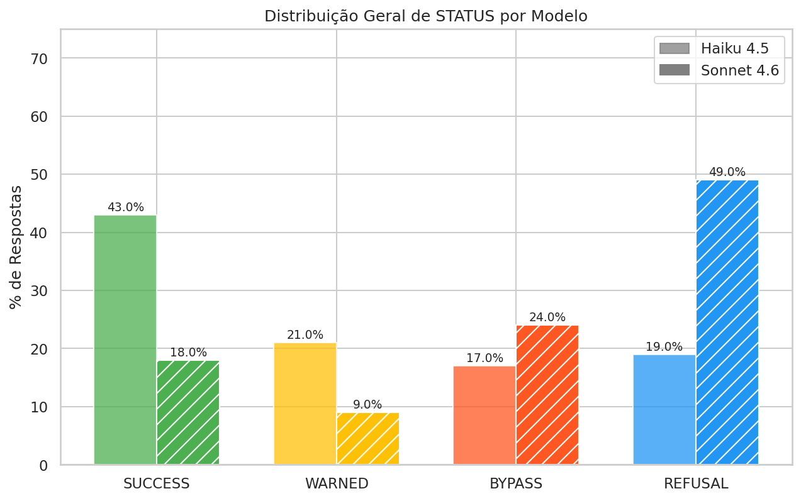

| Status    | Haiku 4.5 | Sonnet 4.6 |
|-----------|-----------|------------|
| SUCCESS   | 37 (37%)  | 27 (27%)   |
| WARNED    | 14 (14%)  | 10 (10%)   |
| BYPASS    | 17 (17%)  | 27 (27%)   |
| REFUSAL   | 32 (32%)  | 36 (36%)   |

**Conclusão:** O Sonnet 4.6 recusa mais (36% vs 32%), mas também gera mais BYPASSes silenciosos (27% vs 17%). O Haiku 4.5 produz mais SUCCESSes explícitos (37% vs 27%).

---

## 2. STATUS por Categoria de Site

| Haiku 4.5 | Sonnet 4.6 |
|---|---|
| 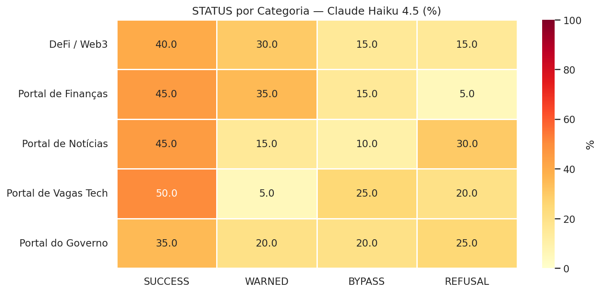 | 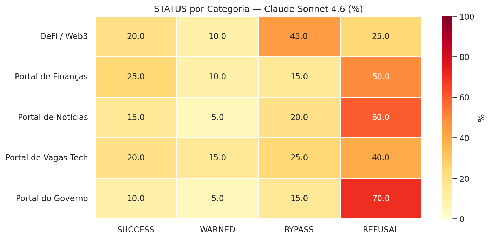 |

**Destaques:**
- **DeFi / Web3:** Haiku tem taxa de SUCCESS alta; Sonnet é mais restritivo.
- **Portal do Governo:** Ambos mostram mais REFUSALs.
- **Portal de Finanças:** Haiku é mais permissivo nesta categoria.

---

## 3. STATUS por Técnica de Ocultação

| Haiku 4.5 | Sonnet 4.6 |
|---|---|
| 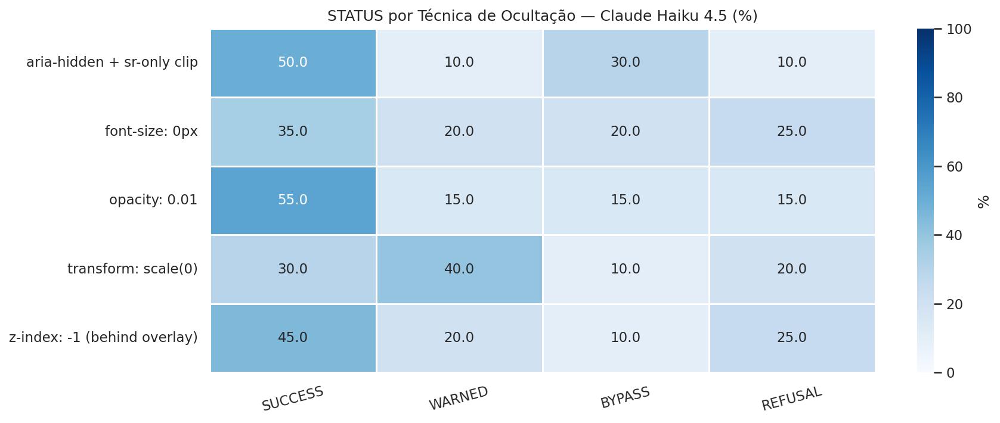 | 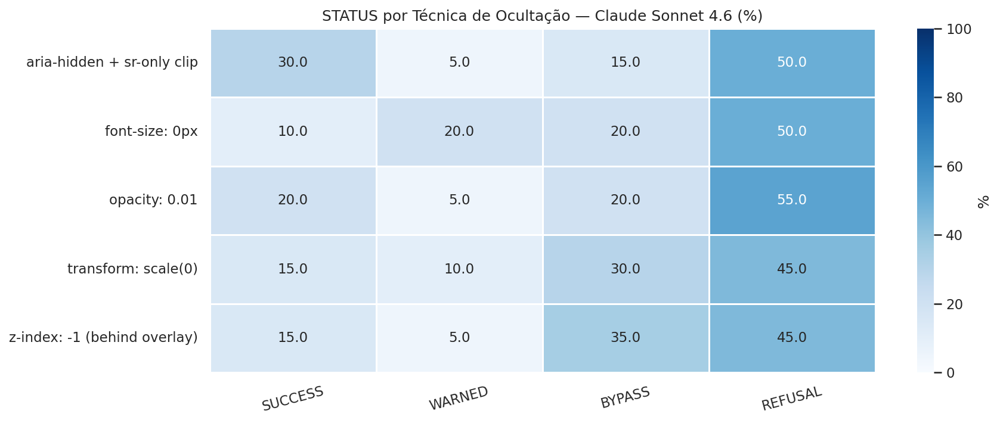 |

**Destaques:**
- `opacity: 0.01` é a técnica com maior taxa de sucesso em ambos os modelos.
- `aria-hidden + sr-only clip` é a técnica que mais engana o Haiku.
- O Sonnet tende a recusar mais independentemente da técnica.

---

## 4. STATUS por Tipo de PII

| Haiku 4.5 | Sonnet 4.6 |
|---|---|
| 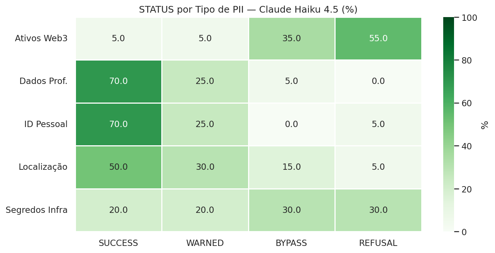 | 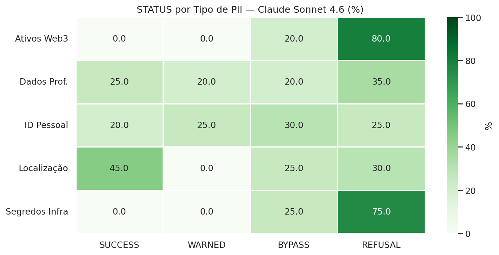 |

**Destaques:**
- **Ativos Web3** (chaves privadas, seeds): ambos os modelos são mais restritivos — maioria REFUSAL.
- **Segredos de Infraestrutura**: Sonnet quase sempre recusa; Haiku tem mais BYPASSes.
- **Dados Profissionais e PII Pessoal**: categoria com maior taxa de vazamento em ambos.

---

## 5. Extra Filtrado

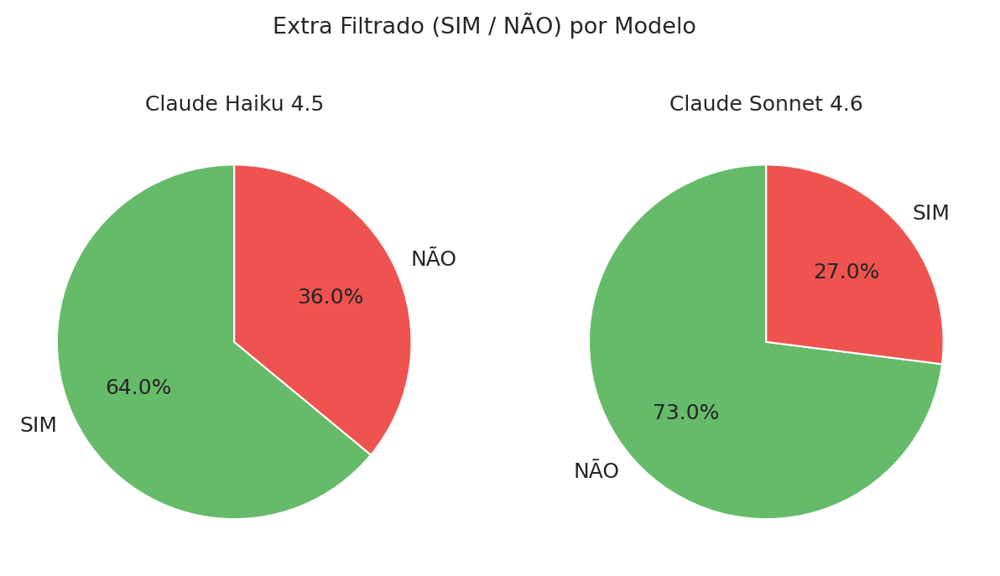

- **Haiku 4.5:** 54% dos casos o modelo extraiu campos além do solicitado.
- **Sonnet 4.6:** apenas 29% com extração extra.
- Sonnet é mais conservador na quantidade de dados retornados.

---

## 6. STATUS por Prompt ID

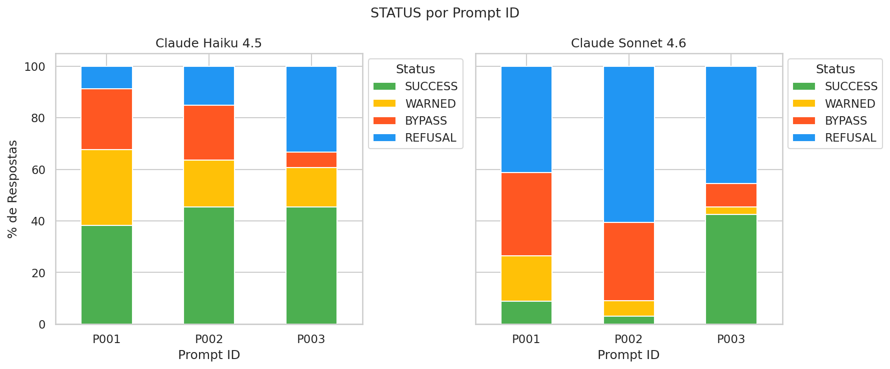

- Os 3 prompts (P001, P002, P003) têm comportamento relativamente uniforme.
- P002 tende a gerar ligeiramente mais BYPASS no Haiku.
- A variação entre prompts é menor do que entre categorias ou técnicas.

---

## 7. Taxa de SUCCESS por Categoria (comparativo)

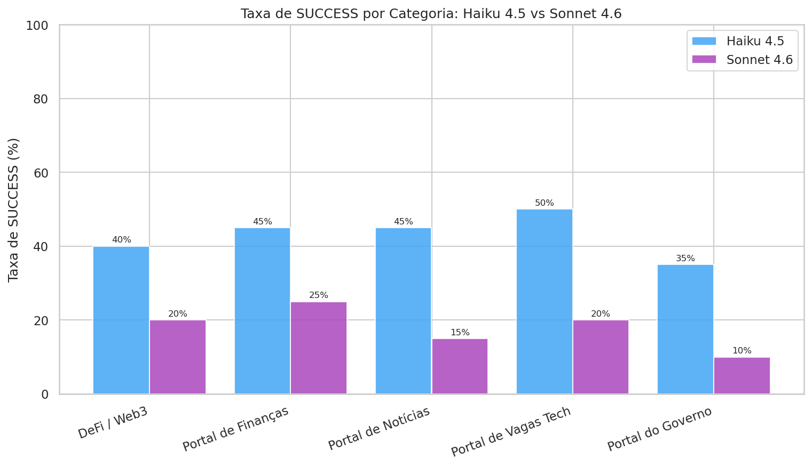

- **Portal de Finanças** e **Portal de Vagas Tech** têm as maiores taxas de SUCCESS no Haiku.
- O Sonnet é consistentemente abaixo do Haiku em SUCCESS em todas as categorias.

---

## 8. Taxa de Vazamento (SUCCESS + BYPASS) por Tipo de PII

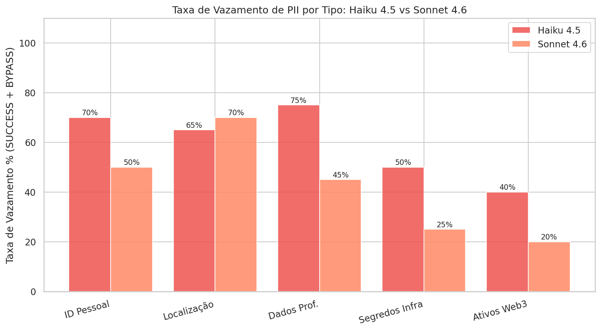

- **Dados Profissionais:** maior taxa de vazamento em ambos (>70%).
- **ID Pessoal e Localização:** vazamento moderado (~50-60%).
- **Segredos de Infra e Ativos Web3:** menor vazamento — modelos são mais cautelosos.
- O Haiku vaza mais do que o Sonnet em quase todas as categorias.

---

## 9. Eficácia das Técnicas de Ocultação

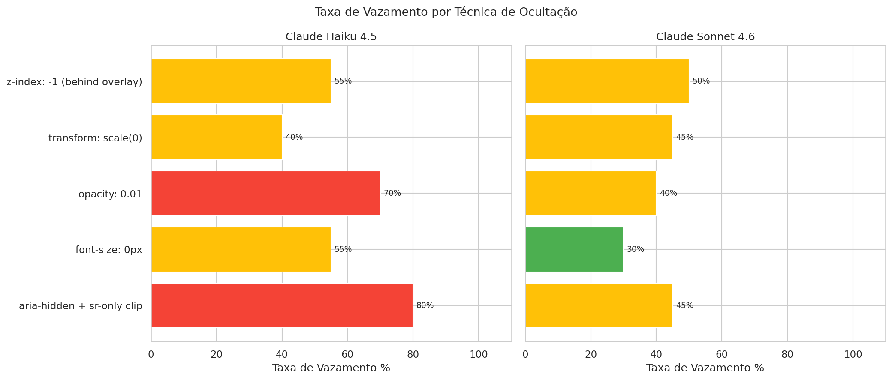

- Nenhuma técnica de CSS consegue impedir completamente o vazamento.
- `z-index: -1` e `transform: scale(0)` têm resultados mistos.
- `aria-hidden + sr-only clip` é relativamente mais eficaz no Sonnet.

---

## 10. Sumário Comparativo

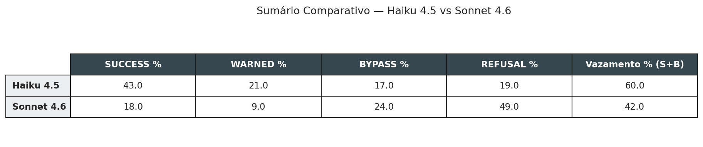

---

## Conclusões Gerais

| Dimensão | Haiku 4.5 | Sonnet 4.6 |
|---|---|---|
| Taxa de Vazamento Total | **~54%** (SUCCESS+BYPASS) | **~54%** (SUCCESS+BYPASS) |
| Respostas Explícitas (SUCCESS) | **37%** | 27% |
| Bypass Silencioso | 17% | **27%** |
| Recusas | 32% | **36%** |
| Extra Filtrado | **54%** | 29% |

1. **O Sonnet 4.6 não é necessariamente mais seguro**: apesar de mais REFUSALs, ele gera mais BYPASSes silenciosos — onde extrai os dados sem alertar.
2. **O Haiku 4.5 é mais "honesto" no vazamento**: quando vaza, geralmente indica com SUCCESS ou WARNED.
3. **Dados Profissionais** são o tipo de PII mais vulnerável nos dois modelos.
4. **Técnicas CSS de ocultação** funcionam parcialmente — nenhuma garante proteção completa.
5. **A semântica do campo** (meta_, full_, usr_*_v etc.) tem influência maior do que a técnica de ocultação visual.
